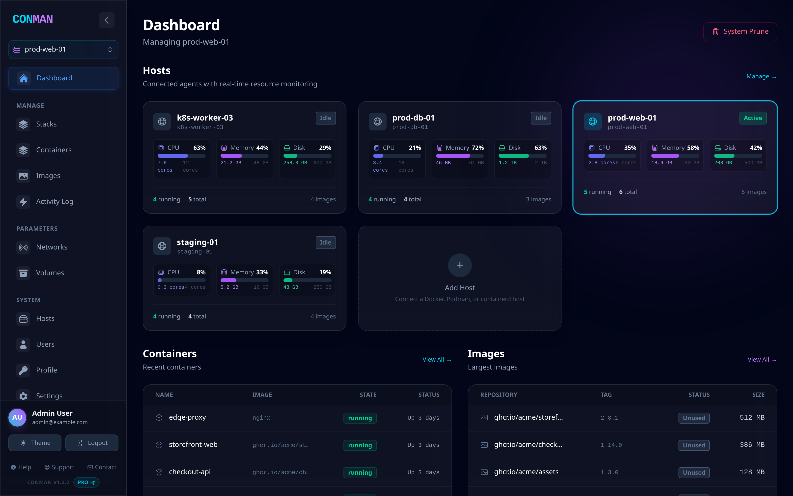
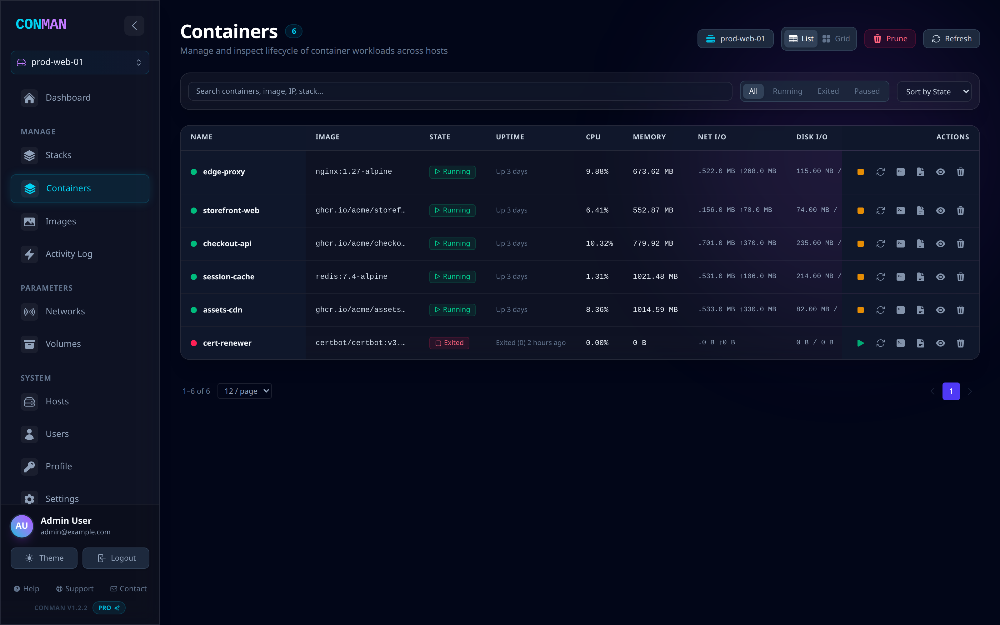
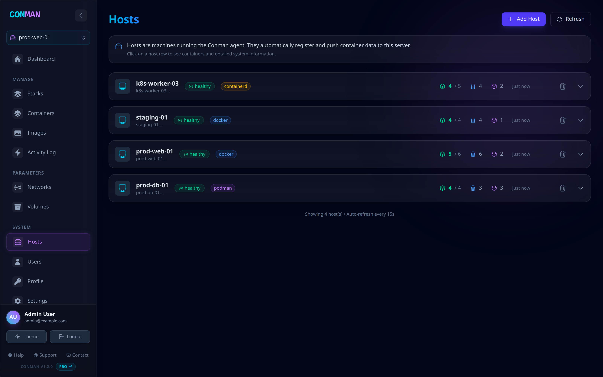

<div align="center">

# Conman

**One dashboard for every container host you run — Docker, Podman, and containerd.**

[](https://github.com/deziss/conman/actions/workflows/ci.yml)
[](https://github.com/deziss/conman/releases)
[](LICENSE)
[](backend/go.mod)
[](frontend/package.json)

[Quick start](#quick-start) · [Features](#what-you-get) · [Installation](docs/INSTALLATION.md) · [Configuration](docs/CONFIGURATION.md) · [API](docs/API.md)



</div>

---

## Why Conman

If your containers live on more than one machine, you end up SSH-ing between hosts and running `docker ps` over and over. Conman replaces that with a single web dashboard.

A lightweight agent runs on each host and pushes its inventory and metrics to a central server. You get one place to see every container, image, network, volume, and stack you run — and you can start, stop, inspect, exec into, and redeploy them without leaving the browser.

**Conman is a good fit if you:**

- Run containers on several hosts and want one view across them
- Use Podman or containerd and can't use Docker-only tools
- Want to self-host on your own infrastructure with no telemetry and no external dependencies
- Need an audit trail and per-role permissions over who can touch production containers

**It is probably not what you want if** you run a single laptop's worth of containers (`docker ps` is fine) or you need a full Kubernetes control plane (Conman monitors containerd nodes, it doesn't schedule pods).

## What you get

| | |
|---|---|
| **Multi-host fleet view** | Every agent reports CPU, memory, and disk in near real time. Switch hosts from one dropdown. |
| **Three runtimes, one UI** | Agents auto-detect Docker, Podman (including rootless), or containerd (namespace-aware) at startup. |
| **Full container lifecycle** | Start, stop, restart, kill, remove, and prune. Inspect config, browse the filesystem, and upload or download files. |
| **Live logs and terminal** | Streaming logs with search and structured parsing, plus a real `xterm.js` shell into any running container. |
| **Images, networks, volumes** | Pull, tag, and prune images; inspect networks and IPAM config; see volume sizes and what references them. |
| **Compose stacks** | Deploy, update, and roll back Docker Compose v2 stacks, with HMAC-signed webhooks for CI/CD. |
| **Alerting** | Rules on agent heartbeat, container state, and resource thresholds, dispatched to Slack, Discord, or any webhook. |
| **Vulnerability scanning** | On-demand and scheduled Trivy scans with CVE breakdown and severity filtering. |
| **RBAC and audit log** | Casbin-backed roles across every resource, plus an activity log of who did what. |
| **Metrics and API** | Prometheus endpoint, a documented REST API, and scoped API keys with expiry. |

<details>
<summary><strong>More screenshots</strong></summary>

**Containers** — sortable, full-width inventory with live CPU, memory, and I/O per container:



**Hosts** — every registered agent with its runtime, health, and container counts:



</details>

## Quick start

You need Docker with the Compose plugin. This brings up the server, the dashboard, and an agent for the local host.

```bash
git clone https://github.com/deziss/conman.git
cd conman

# Conman has no insecure defaults — it will not boot without these.
export SECRET_KEY=$(openssl rand -hex 32)
export MASTER_API_KEY=$(openssl rand -hex 32)

docker compose -f docker-compose.simple.yml up -d --build
```

Open **http://localhost:5173** and sign in with `admin@example.com` / `admin`.

> [!IMPORTANT]
> Change the admin password before exposing Conman to a network. Set `ADMIN_PASSWORD` and restart — the server re-applies it on every boot, which doubles as password recovery. Keep `SECRET_KEY` and `MASTER_API_KEY` out of version control.

### Adding another host

Install the agent on any machine you want to monitor and point it at the server:

```bash
# On the host you want to add
sudo dpkg -i conman-agent_1.2.1_amd64.deb      # or: rpm -i conman-agent-1.2.1-1.x86_64.rpm
sudo vi /etc/conman-agent/agent.env            # set CONMAN_SERVER_URL and CONMAN_SERVER_TOKEN
sudo systemctl enable --now conman-agent
```

`CONMAN_SERVER_TOKEN` must match the server's `AGENT_TOKEN`. The agent detects the container runtime by itself; set `RUNTIME_TYPE` only if you want to force one. It shows up in the dashboard within a few seconds.

## Installing in production

<details>
<summary><strong>Linux packages (.deb / .rpm) with systemd</strong></summary>

```bash
# Debian / Ubuntu
sudo dpkg -i conman-server_1.2.1_amd64.deb
sudo vi /etc/conman/server.env        # SECRET_KEY and MASTER_API_KEY are auto-generated on first install
sudo systemctl enable --now conman-server

# RHEL / Fedora
sudo rpm -i conman-server-1.2.1-1.x86_64.rpm
sudo vi /etc/conman/server.env
sudo systemctl enable --now conman-server
```

The postinstall script generates real random secrets into `/etc/conman/server.env` on a fresh install and never overwrites a file you have already customized.

</details>

<details>
<summary><strong>PostgreSQL with horizontal scaling</strong></summary>

SQLite is fine for a handful of hosts. For larger fleets, run PostgreSQL and scale the backend behind Kong:

```bash
export AGENT_TOKEN=your-agent-psk
export SECRET_KEY=$(openssl rand -hex 32)
export MASTER_API_KEY=$(openssl rand -hex 32)
export POSTGRES_PASSWORD=your-pg-password

docker compose -f docker-compose.scaled.yml up -d --scale conman-backend=3
```

Kong load-balances across the replicas with active health checks.

</details>

<details>
<summary><strong>Building packages from source</strong></summary>

Prerequisites: Go 1.24+, Node 22 (see `.nvmrc`), and [nfpm](https://nfpm.goreleaser.com/).

```bash
./packaging/build-packages.sh              # version comes from ./VERSION
VERSION=2.0.0 ./packaging/build-packages.sh
```

Output lands in `dist/`: `conman-server` (~12 MB) and `conman-agent` (~7 MB), each as `.deb` and `.rpm`.

</details>

## Container runtime support

The agent probes for a runtime socket at startup. Set `RUNTIME_TYPE` to pin one explicitly.

| Runtime | Default socket | Notes |
|---------|----------------|-------|
| Docker | `/var/run/docker.sock` | Full feature support |
| Podman | `/run/podman/podman.sock` | API and CLI modes, rootless supported |
| containerd | `/run/containerd/containerd.sock` | Native gRPC, namespace-aware |

```bash
RUNTIME_TYPE=containerd
RUNTIME_SOCKET_PATH=/run/containerd/containerd.sock
CONTAINERD_NAMESPACE=k8s.io          # to see Kubernetes workloads
```

## Editions

Conman is free and open source under the AGPL-3.0. Some features are gated behind a license key.

| | Community | Pro | Enterprise |
|---|:---:|:---:|:---:|
| Hosts | 1 | 10 | Unlimited |
| Containers, images, networks, volumes | ✅ | ✅ | ✅ |
| Logs, terminal, file browser | ✅ | ✅ | ✅ |
| Alerts and notification channels | ✅ | ✅ | ✅ |
| Compose stacks | — | ✅ | ✅ |
| Image update checking | — | ✅ | ✅ |
| Self-service API keys | — | ✅ | ✅ |
| Multi-role RBAC | — | — | ✅ |
| SSO | — | — | ✅ |
| Audit log | — | — | ✅ |

Without a license key, Conman runs in Community mode: a single host, and the admin role has full access.

## Architecture

```
                         +-------------------+
                         |   Web Dashboard   |
                         |   (React 19 SPA)  |
                         +---------+---------+
                                   |
                         +---------v---------+
                         |   Conman Server   |
                         |   (Go REST + WS)  |
                         | SQLite / Postgres |
                         +----+----+----+----+
                              |    |    |
              +---------------+    |    +----------------+
              |                    |                     |
     +--------v--------+  +--------v-------+  +----------v--------+
     | Agent (Docker)  |  | Agent (Podman) |  | Agent (containerd)|
     |     Host A      |  |     Host B     |  |      Host C       |
     +-----------------+  +----------------+  +-------------------+
```

**Server** (`backend/`) — Go REST API and WebSocket server built on Chi, GORM, and Casbin, with Prometheus instrumentation and a built-in alert evaluator. Runs on SQLite or PostgreSQL.

**Agent** (`agent/`) — a ~18 MB Go binary on each monitored host. Collects container, image, network, and volume inventory plus per-container metrics, and pushes reports to the server. Buffers and retries with exponential backoff when the server is unreachable.

**Frontend** (`frontend/`) — React 19 SPA with TanStack Query, Tailwind CSS v4, Recharts, and xterm.js.

<details>
<summary><strong>Repository layout</strong></summary>

```
conman/
  backend/                 # Go server
    cmd/server/            # entry point
    internal/
      api/                 # HTTP handlers
      alerts/              # alert evaluator and notifiers
      authz/               # Casbin RBAC
      config/              # Viper configuration
      license/             # tier and feature gating
      metrics/             # time-series metrics store
      middleware/          # auth, agent PSK, license gates
      models/              # GORM models
      observability/       # Prometheus instrumentation
      service/             # runtime client, stats collector, compose
    pkg/protocol/          # shared agent<->server types
  agent/                   # Go agent
    cmd/agent/
    internal/
      agent/               # core loop, pusher, buffer, local API
      runtime/             # ContainerRuntime interface + Docker/Podman/containerd
      log/ retry/
  frontend/                # React 19 + TypeScript SPA
    src/pages/ components/ services/ contexts/
  packaging/               # nfpm definitions, systemd units, build script
  docs/                    # installation, configuration, API reference
```

</details>

## Development

```bash
# Backend
cd backend && go vet ./... && go build ./... && go test ./...

# Agent
cd agent && go vet ./... && go build ./... && go test ./...

# Frontend
cd frontend && npm install --legacy-peer-deps
npm run dev                      # dev server on :5173
npx tsc -b && npx vitest run     # typecheck + unit tests
```

> [!NOTE]
> Use `tsc -b`, not `tsc --noEmit`. The root `tsconfig.json` is solution-style (`"files": []`), so a plain `tsc --noEmit` type-checks nothing and silently passes.

CI (`.github/workflows/ci.yml`) runs the backend, agent, and frontend checks on every push and pull request to `main`.

## Documentation

- [Installation guide](docs/INSTALLATION.md) — per-runtime setup, systemd, reverse proxies
- [Configuration reference](docs/CONFIGURATION.md) — every environment variable
- [API reference](docs/API.md) — REST endpoints, auth, and agent protocol
- [Agent architecture](agents.md) — collection loop and runtime interface
- [Theming](docs/THEME_STYLING.md) — design tokens and dark mode
- [Changelog](CHANGELOG.md)

## Contributing

Issues and pull requests are welcome. Please run `go vet`, `go test`, `npx tsc -b`, and `npx vitest run` before opening a PR — CI runs the same checks.

## License

Conman is licensed under the **GNU Affero General Public License v3.0 or later**. See [LICENSE](LICENSE).

The AGPL's network clause applies: if you run a modified Conman and let others use it over a network, you must offer them the source of your modified version.
